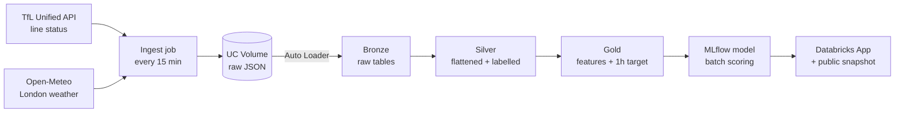

# London Transport Delay Predictor

An end-to-end Databricks project: live TfL line status and London weather are ingested every 15 minutes, refined through a Bronze → Silver → Gold Lakeflow pipeline, and turned into a model that predicts whether a line will be disrupted **one hour from now**. Built entirely on **Databricks Free Edition** (serverless only).

> Part 1 of 3 end-to-end Databricks projects on [hulash.com](https://hulash.com).

## Architecture



| Layer | Table | Grain |
|---|---|---|
| Bronze | `tfl.bronze.line_status_raw`, `tfl.bronze.weather_raw` | one row per poll, raw payload |
| Silver | `tfl.silver.line_status` | one row per line per status per poll |
| Silver | `tfl.silver.weather` | one row per distinct weather reading |
| Gold | `tfl.gold.line_features` | one row per line per 15-min slot |

## Repo layout

```
notebooks/
  00_connectivity_test.py   # checks the key + outbound access
  01_setup.sql              # catalog, schemas, landing volume
  02_ingest_raw.py          # polls APIs, lands raw JSON
src/pipeline/
  03_bronze.py              # Auto Loader -> Delta
  04_silver.py              # flatten, label, dedupe, expectations
  05_gold.py                # features + 1-hour-ahead target
databricks.yml              # Asset Bundle: pipeline + both jobs
```

## Setup

1. Get a free key from the [TfL API portal](https://api-portal.tfl.gov.uk/) (Unified API product).
2. Install the [Databricks CLI](https://docs.databricks.com/dev-tools/cli/install.html) and log in:
   ```
   databricks auth login --host https://<your-workspace>.cloud.databricks.com
   ```
3. Store the key as a secret:
   ```
   databricks secrets create-scope tfl
   databricks secrets put-secret tfl app_key
   ```
4. Run `notebooks/00_connectivity_test.py`, then `notebooks/01_setup.sql`.
5. Deploy the pipeline and jobs:
   ```
   databricks bundle deploy
   ```

## Design decisions

- **Scheduled micro-batches instead of a continuous stream.** Free Edition has daily compute quotas and a cap on concurrent serverless resources, so ingestion polls every 15 minutes and Auto Loader processes only new files. Same incremental semantics, a fraction of the cost.
- **Ingestion and pipeline run on separate schedules.** Ingest every 15 min (cheap); pipeline hourly at :07 so the two never compete for compute.
- **Bronze stays raw.** The full API payload is kept untouched, with file lineage columns, so Silver can be rebuilt at any time.
- **Grain in Silver is a status, not a line.** A line can carry two statuses at once (e.g. part closure + minor delays).
- **Planned works are excluded from the target.** Scheduled engineering closures aren't something you predict from conditions; they're flagged with `is_planned` instead.
- **Time features use London local time,** so the BST/GMT switch doesn't shift the hour of day.
- **One Gold table for training and scoring.** Rows from the latest hour have no target yet; those are exactly the rows the model scores.

## Gotchas I hit

- **Windows CLI keyring error** (`OS keyring unreachable`): fixed with `$env:DATABRICKS_AUTH_STORAGE="plaintext"` before logging in, then passing `-p <profile>` to commands.
- **TfL returned 429 "Invalid app_key".** The stored key was 33 characters: a pasted null character (`\x00`) had snuck in. Checking `len(key)` found it in seconds.
- **`RESOURCE_EXHAUSTED` when starting the SQL warehouse.** That's the concurrent serverless limit on Free Edition. Run ad-hoc queries from a notebook already on serverless instead.

## Next

- [ ] Model training with MLflow, registered in Unity Catalog
- [ ] Batch scoring into `tfl.gold.predictions`
- [ ] Databricks App front end
- [ ] Public snapshot on hulash.com
