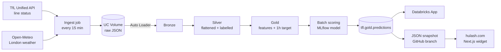

# London Transport Delay Predictor

An end-to-end Databricks project: live TfL line status and London weather are ingested every 15 minutes, refined through a Bronze → Silver → Gold Lakeflow pipeline, and turned into a model that predicts whether a line will be disrupted **one hour from now**. Predictions are served in a Databricks App and published as a public snapshot on [hulash.com](https://hulash.com). Built entirely on **Databricks Free Edition** (serverless only).

> Part 1 of 3 end-to-end Databricks projects.

## Architecture



### Schedules

| Job | Schedule | Tasks |
|---|---|---|
| `tfl_ingest_raw` | every 15 min | poll APIs → land raw JSON |
| `tfl_pipeline_hourly` | :07 past every hour | pipeline → score → export snapshot |

### Tables

| Layer | Table | Grain |
|---|---|---|
| Bronze | `tfl.bronze.line_status_raw`, `tfl.bronze.weather_raw` | one row per poll, raw payload |
| Silver | `tfl.silver.line_status` | one row per line per status per poll |
| Silver | `tfl.silver.weather` | one row per distinct weather reading |
| Gold | `tfl.gold.line_features` | one row per line per 15-min slot |
| Gold | `tfl.gold.predictions` | one prediction per line per slot, kept as history |
| Model | `tfl.gold.delay_model` | UC registered model; `champion` alias = production |

## Repo layout

```
notebooks/
  00_connectivity_test.py   # checks the key + outbound access
  01_setup.sql              # catalog, schemas, landing volume
  02_ingest_raw.py          # polls APIs, lands raw JSON
  06_train_model.py         # time-split training, baseline, MLflow, UC registry
  07_score.py               # batch scoring -> tfl.gold.predictions
  08_export_snapshot.py     # public JSON snapshot -> GitHub `snapshot` branch
src/pipeline/
  03_bronze.py              # Auto Loader -> Delta
  04_silver.py              # flatten, label, dedupe, expectations
  05_gold.py                # features + 1-hour-ahead target
app/                        # Databricks App (Streamlit)
web/tfl-forecast/           # Next.js server component used on hulash.com
databricks.yml              # Asset Bundle: pipeline + both jobs
```

## Setup

1. Get a free key from the [TfL API portal](https://api-portal.tfl.gov.uk/) (Unified API product).
2. Install the [Databricks CLI](https://docs.databricks.com/dev-tools/cli/install.html) and log in:
   ```
   databricks auth login --host https://<your-workspace>.cloud.databricks.com
   ```
3. Store secrets:
   ```
   databricks secrets create-scope tfl
   databricks secrets put-secret tfl app_key        # TfL key
   databricks secrets put-secret tfl github_token   # fine-grained PAT, Contents: read/write on this repo
   ```
4. Create a `snapshot` branch on GitHub (the export job writes `latest.json` there).
5. Run `notebooks/00_connectivity_test.py`, then `notebooks/01_setup.sql`.
6. Deploy the pipeline and jobs: `databricks bundle deploy`
7. After a few hours of data, run `notebooks/06_train_model.py` once to register the first model.
8. **App:** Compute → Apps → Create, add a SQL warehouse resource with key `sql-warehouse`, deploy from `./app`, then grant the app's service principal **Data Reader** on the `tfl` catalog.

## Design decisions

- **Scheduled micro-batches instead of a continuous stream.** Free Edition has daily compute quotas and a cap on concurrent serverless resources, so ingestion polls every 15 minutes and Auto Loader processes only new files. Same incremental semantics, a fraction of the cost.
- **Ingestion and pipeline run on separate schedules,** offset to :07 so they never compete for compute. Jobs run with performance-optimised mode off to save quota.
- **Bronze stays raw.** The full API payload is kept untouched, with file lineage columns, so Silver can be rebuilt at any time.
- **Grain in Silver is a status, not a line.** A line can carry two statuses at once (e.g. part closure + minor delays).
- **Planned works are excluded from the target.** Scheduled engineering closures aren't predicted from conditions; they're flagged with `is_planned` instead.
- **Time features use London local time,** so the BST/GMT switch doesn't shift the hour of day.
- **One Gold table for training and scoring.** Rows from the latest hour have no target yet; those are exactly the rows the model scores.
- **Time-based train/test split** — a random split would leak the future into training.
- **The model has to earn promotion.** Every run is registered, but the `champion` alias only moves if it beats a persistence baseline ("whatever a line is doing now, it'll still be doing in an hour").
- **Predictions are kept as history,** so every forecast is checked against what actually happened. Both the app and the website show this track record.
- **Public site reads a static snapshot, not Databricks.** The export job pushes a small JSON file to a GitHub branch; the Next.js widget fetches it server-side with a 15-minute cache. Always on, free, and the workspace is never exposed. If the jobs stop, the widget says the forecast is paused instead of showing stale data as live.

## Gotchas I hit

- **Windows CLI keyring error** (`OS keyring unreachable`): fixed with `$env:DATABRICKS_AUTH_STORAGE="plaintext"` before logging in, then passing `-p <profile>` to commands.
- **TfL returned 429 "Invalid app_key".** The stored key was 33 characters: a pasted null character (`\x00`) had snuck in. Checking `len(key)` found it in seconds.
- **`RESOURCE_EXHAUSTED` when starting the SQL warehouse.** That's the concurrent serverless limit on Free Edition. Run ad-hoc queries from a notebook already on serverless instead.
- **Notebook pasted as one giant cell.** Copy-pasting a `.py` file ignores the `# COMMAND ----------` markers; importing the file splits it into proper cells.
- **Training notebook inside the pipeline folder.** Anything in `transformations/` runs as pipeline code, so notebooks live in a separate folder.
- **MLflow integer-schema warning.** Integer columns can't hold missing values, so scoring would fail on NaNs; features are cast to float before training.
- **App: `INSUFFICIENT_PERMISSIONS` on catalog `tfl`.** Apps run as their own service principal, which needs explicit Unity Catalog grants.

## Next

- [x] Ingestion, Bronze/Silver/Gold pipeline
- [x] Model training with MLflow, registered in Unity Catalog
- [x] Batch scoring into `tfl.gold.predictions`
- [x] Databricks App front end
- [x] Public snapshot on hulash.com
- [ ] Retrain on a week+ of data, tune threshold, promote first `champion`
- [ ] Weekly retrain task
